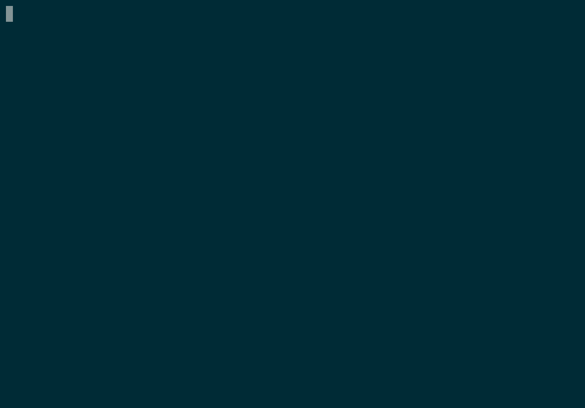

# wxcast

A CLI utility for retrieving weather information.

## Overview

Provides weather information in terminal:

-   Weather text information from NWS API.
-   METAR info from AVWX API.
-   Seven day forecasts based on location using geopy and NWS API.

## Installation

    pip install wxcast

## Requirements

-   certifi
-   Click&gt;=6.0
-   geopy
-   requests

## Test Requirements

-   flake8
-   pytest
-   pytest-cov
-   vcrpy

## Usage

###  METAR

Provides the METAR information for a given airport ICAO:

    >>> wxcast metar kden
    KDEN 250100Z 06011KT 1/2SM -DZ BR OVC005 09/07 A2999 RMK AO2 SFC VIS 1 1/2 P0001 T00890072

The data can be decoded and pretty printed to terminal using the
-d/--decoded option.

    >>> wxcast metar -d kden
    At 250100Z the conditions for KDEN are LIFR

      Altimeter:  29.99inHg (1016hPa)
         Clouds:  Overcast layer at 500ft - Reported AGL
       Dewpoint:  07C (45F)
          Other:  Light Drizzle, Mist
    Temperature:  09C (48F)
     Visibility:  0.5sm (0.8km)
           Wind:  ENE-060 at 11kt

           City:  Denver
        Country:  USA
      Elevation:  5433ft (1656m)
           IATA:  DEN
           ICAO:  KDEN
       Latitude:  39.86165639
      Longitude:  -104.6731775
           Name:  International Airport
       Priority:  0
          State:  CO

### Products

Provides the available text products for a given WFO (weather forecast
office).

    >>> wxcast products bou
    AFD:  Area Forecast Discussion
    CAP:  Common Alerting Protocol
    FDI:  Fire Danger Indices
    FWF:  Routine Fire Wx Fcst (With/Without 6-10 Day Outlook)
    FWL:  Land Management Forecasts
    FWM:  Miscellaneous Fire Weather Product
    FWN:  Fire Weather Notification
    FWO:  Fire Weather Observation
    FWS:  Suppression Forecast
    HML:  AHPS XML
    HRR:  Weather Roundup
    HWO:  Hazardous Weather Outlook
    OSO:  Other Surface Observations
    PFM:  Point Forecast Matrices
    PNS:  Public Information Statement
    RFW:  Red Flag Warning
    RR2:  Hydro-Met Data Report Part 2
    RR3:  Hydro-Met Data Report Part 3
    RR9:  Hydro-Met Data Report Part 9
    RRS:  HADS Data
    RTP:  Regional Max/Min Temp and Precipitation Table
    SRG:  Soaring Guidance
    STQ:  Spot Forecast Request
    SYN:  Regional Weather Synopsis
    TVL:  Travelers Forecast
    VFT:  Terminal Aerodrome Forecast (TAF) Verification
    ZFP:  Zone Forecast Product

### Text Product

Provides the text information for the given product and WFO. Displays
text in a pager window for easier reading and scrolling.

    >>> wxcast text bou afd

### Forecast

Provides the seven day NWS forecast for the given location.

    >>> wxcast forecast denver
            Tonight:  Rain showers likely. Cloudy. Low around 42, with temperatures
                      rising to around 45 overnight. North northeast
                      wind around 7 mph. Chance of precipitation is
                      60%. New rainfall amounts less than a tenth of an
                      inch possible.
             Monday:  A chance of rain showers. Mostly cloudy, with a high near 53.
                      North northeast wind around 7 mph. Chance of
                      precipitation is 30%. New rainfall amounts less
                      than a tenth of an inch possible.
       Monday Night:  A slight chance of showers and thunderstorms before midnight.
                      Mostly cloudy, with a low around 41. South
                      southeast wind around 3 mph. Chance of
                      precipitation is 20%. New rainfall amounts less
                      than a tenth of an inch possible.
    ...

The location can be a city, address or zip/postal code.

    >>> wxcast forecast 80303
    ...

If there are spaces in the location it must be surrounded by quotes.

    >>> wxcast forecast "325 Broadway Boulder, CO"
    ...

## Issues/Enhancements

Please submit issues and requests to
[Github](https://github.com/smarlowucf/wxcast/issues).

## Contributing

Contributions to **wxcast** are welcome and encouraged. See
[CONTRIBUTING](CONTRIBUTING.md) for info on getting started.

## License

Copyright (c) 2017 Sean Marlow.

Distributed under the terms of GPL-3.0+ license, see [LICENSE](LICENSE)
for details.
